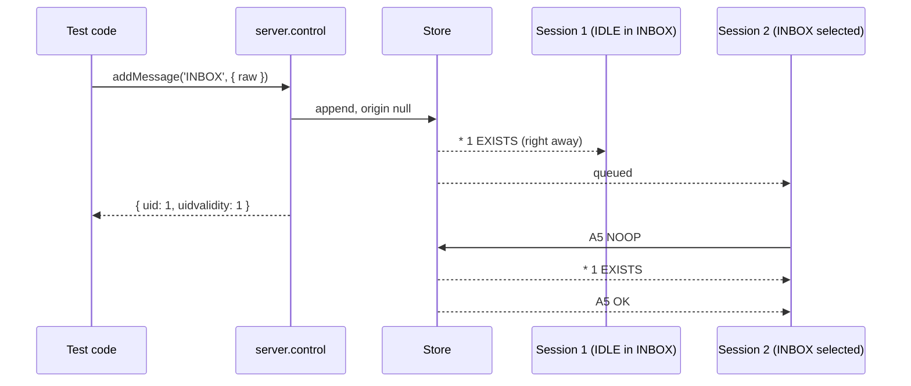

# Control API overview

`server.control` inspects and changes the server from your test code, without an IMAP session. Use it to deliver a message while the client idles, flip flags behind the client's back, delete the mailbox the client has selected, or reset UIDVALIDITY to test a resync. Every method is synchronous except `shutdown()`, returns plain data, and throws an `ImapKitError` when an argument is wrong.

```javascript
import imapkit from 'imapkit';

const server = imapkit({ plugins: ['IDLE', 'CONDSTORE'] });
const port = await server.start();

const { uid } = server.control.addMessage('INBOX', { raw: 'Subject: hello\r\n\r\nHi!\r\n', flags: ['\\Seen'] });
server.control.setFlags('INBOX', [uid], ['\\Flagged'], 'add');
server.control.expungeMessages('INBOX', [uid]);

await server.stop();
```

The same operations are available over HTTP through the [REST API](../rest-api/overview.md), for test suites that are not written in JavaScript.

## Changes look like another session's

The control API changes the shared store the same way an IMAP command from another session would, so the connected sessions learn about it through the normal protocol:

| Change                                    | What a session that has the mailbox selected sees                              |
| ----------------------------------------- | ------------------------------------------------------------------------------ |
| a new message (`addMessage`, copy, move)  | `* n EXISTS`, and the message is `\Recent` for the first read-write session    |
| removed messages (expunge, move, replace) | `* n EXPUNGE` and a new `EXISTS`, or `* VANISHED` after `ENABLE QRESYNC`       |
| changed flags (`setFlags`)                | `* n FETCH (UID u FLAGS (...))`, with `MODSEQ` after `ENABLE CONDSTORE`        |
| the mailbox is deleted                    | `* BYE Selected mailbox was deleted`, and the connection closes                |
| new UIDVALIDITY (`resetUidValidity`)      | `* BYE UIDVALIDITY of the selected mailbox changed`, and the connection closes |

A session in IDLE gets these responses right away. Any other session gets them before the tagged response of its next command (`NOOP` is the usual way to ask), following the same rules as changes from a real second session: FETCH, STORE, SEARCH, SORT and THREAD hold back EXPUNGE responses (RFC 3501 section 7.4.1), and messages expunged while a session can not be told stay in its view until it can. See [Multiple sessions](../guides/multiple-sessions.md) for the details. Sessions that use NOTIFY or CONTEXT=SEARCH get their updates too.

Every change has no session as its **origin**. Inside the server, a change made by a command carries the session that ran it, so that, for example, NOTIFY does not report a session's own changes back to it. A control API change has `origin: null`, which means every session is told, including one that is running a command at that moment. The `mailbox`, `expunge` and `flags` [events](./events.md) carry the same `origin` value, `null` for the control API. This also holds when you call the control API from inside an event listener that fires during a command.



## ACL does not apply

The control API is the operator, not a user. The [ACL](../extensions/access-control.md) plugin does not check its calls, so a test can add a message to a mailbox no user may write to, or read one no user may see. Use `setAcl()` to change what the IMAP users may do.

## Every argument is checked

The control API refuses what the IMAP commands would refuse, before anything changes:

- Mailbox names must be non-empty strings. A new name (`createMailbox`, `renameMailbox`) must be valid modified UTF-7.
- UIDs must be an array of positive integers, and every UID must exist in the mailbox. Duplicates are ignored.
- Flags follow the STORE rules: system flags the server knows (never `\Recent`), valid keywords, and in a mailbox that does not allow new keywords only its permanent flags.
- A message source must be a non-empty string or `Buffer`/`Uint8Array`, an internal date a `Date` or an RFC 3501 date-time string.
- Operations on mailboxes follow the CREATE, DELETE and RENAME rules: INBOX can not be created or deleted, a mailbox with children becomes a `\Noselect` level when deleted, a mailbox can not be renamed into itself.

## ImapKitError

Every refused call throws an `ImapKitError`. Its `name` is `"ImapKitError"`, `message` is a readable explanation and `code` is one of:

| `code`          | Meaning                                                                                                                                                                                                   | REST status |
| --------------- | --------------------------------------------------------------------------------------------------------------------------------------------------------------------------------------------------------- | ----------- |
| `NONEXISTENT`   | the mailbox, message UID, user, session or ACL entry does not exist                                                                                                                                       | 404         |
| `ALREADYEXISTS` | the mailbox or user exists already                                                                                                                                                                        | 409         |
| `INVALID`       | an argument has the wrong type or value                                                                                                                                                                   | 400         |
| `TOOBIG`        | `addMessage` with `checks: true` refused the message because of [APPENDLIMIT](../extensions/messages.md)                                                                                                  | 413         |
| other codes     | the IMAP response code of a failed operation, such as `CANNOT` and `OVERQUOTA` ([RFC 5530](https://www.rfc-editor.org/rfc/rfc5530)) or `HASCHILDREN` ([RFC 9051](https://www.rfc-editor.org/rfc/rfc9051)) | 409         |

The class is exported by the package, so a test can check for it:

```javascript
import imapkit, { ImapKitError } from 'imapkit';

const server = imapkit();
try {
    server.control.addMessage('Nope', { raw: 'x' });
} catch (err) {
    console.log(err instanceof ImapKitError, err.code, err.message);
    // true NONEXISTENT Mailbox "Nope" does not exist
}
```

The CommonJS build has it too: `require('imapkit').ImapKitError`.

## Mailbox names are storage names

Mailboxes are addressed by their **storage name**: the name in modified UTF-7 ([RFC 3501 section 5.1.3](https://www.rfc-editor.org/rfc/rfc3501#section-5.1.3)) with the hierarchy delimiter of its namespace, the same name a client sees in `LIST` before `ENABLE UTF8=ACCEPT`. A mailbox called `Café` is `Caf&AOk-`, a child of `Work` is `Work/Projects` with the default `/` delimiter. `INBOX` matches in any case. Names with non-ASCII characters are refused:

```javascript
server.control.createMailbox('Café');
// ImapKitError INVALID: Mailbox name must use modified UTF-7 for non-ASCII characters (RFC 3501 section 5.1.3)
server.control.createMailbox('Caf&AOk-').path;
// 'Caf&AOk-'
```

The [Storage](../guides/storage.md) guide describes namespaces and delimiters.

## Messages are addressed by UID

Messages are always identified by mailbox and UID, never by sequence number, since sequence numbers belong to a session. Methods that create messages return the new UID together with the UIDVALIDITY of the mailbox, so a test can compare them with what the client reports.

## Where to go next

- [Mailboxes and messages](./mailboxes-and-messages.md): inspect and change the store.
- [UIDVALIDITY](./uidvalidity.md): reset UIDVALIDITY and renumber UIDs to test resync logic.
- [Users and sessions](./users-and-sessions.md): accounts, connected sessions, disconnects, raw output, reset and shutdown.
- [Events](./events.md): wait for "the client selected INBOX" instead of polling.
- [Plugin operations](./plugin-operations.md): ACL, QUOTA, METADATA, SPECIAL-USE, OBJECTID and operations of your own plugins.
