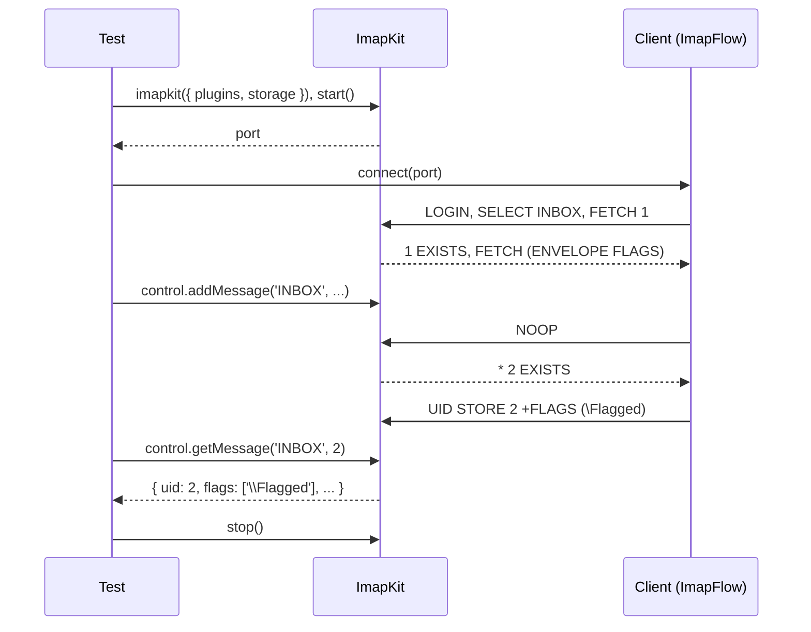

# Quick Start

This page builds a complete integration test: a fresh ImapKit server with one message, a real IMAP client ([ImapFlow](https://imapflow.com/)) that reads it, a change made on the server while the client is connected, and assertions on both sides. It uses the built-in [Node.js test runner](https://nodejs.org/api/test.html), so nothing else is needed.

## 1. Install

```bash
npm install --save-dev imapkit imapflow
```

ImapFlow stands in for the client you are testing. Any IMAP client works the same way: it only needs a host, a port and the credentials `testuser` / `testpass`.

## 2. Write the test

```javascript title="test/inbox.test.mjs"
import { test } from 'node:test';
import assert from 'node:assert/strict';
import imapkit from 'imapkit';
import { ImapFlow } from 'imapflow';

test('the client reads INBOX and notices new mail', async t => {
    // 1. A fresh server with one message in INBOX, on a free port
    const server = imapkit({
        plugins: ['IDLE', 'UIDPLUS', 'MOVE'],
        storage: {
            INBOX: {
                messages: [
                    {
                        raw: 'From: Alice <alice@example.com>\r\nSubject: Welcome\r\n\r\nHello there!\r\n',
                        flags: ['\\Seen']
                    }
                ]
            }
        }
    });
    const port = await server.start();
    t.after(() => server.stop());

    // 2. Connect the client under test as the default user
    const client = new ImapFlow({
        host: '127.0.0.1',
        port,
        secure: false,
        auth: { user: 'testuser', pass: 'testpass' },
        logger: false
    });
    await client.connect();

    // 3. Exercise the client and assert on what it reports
    const mailbox = await client.mailboxOpen('INBOX');
    assert.equal(mailbox.exists, 1);

    const message = await client.fetchOne('1', { envelope: true, flags: true });
    assert.equal(message.envelope.subject, 'Welcome');
    assert.ok(message.flags.has('\\Seen'));

    // 4. Change the server from the test, like a new delivery would
    const { uid } = server.control.addMessage('INBOX', {
        raw: 'From: Bob <bob@example.com>\r\nSubject: Second\r\n\r\nAnother one\r\n'
    });
    assert.equal(uid, 2);

    // the client learns about it with its next command
    await client.noop();
    assert.equal(client.mailbox.exists, 2);

    // 5. Assert on the server state the client left behind
    await client.messageFlagsAdd({ uid: '2' }, ['\\Flagged'], { uid: true });
    assert.deepEqual(server.control.getMessage('INBOX', 2).flags, ['\\Flagged']);

    await client.logout();
});
```

## 3. Run it

```bash
node --test
```

```text
✔ the client reads INBOX and notices new mail (20.156959ms)
ℹ tests 1
ℹ pass 1
ℹ fail 0
```

## What happened



- **`imapkit(options)`** builds a server. `plugins` turns on extensions, `storage` is the mailbox tree it starts from. Without `storage` the server has an empty INBOX. See [Storage](../guides/storage.md) for the format.
- **`server.start()`** listens on a free port and resolves with it, so tests can run in parallel. `server.start(1143, '127.0.0.1')` picks a fixed port and address.
- **`t.after(() => server.stop())`** closes the server and every session when the test ends, even when an assertion failed.
- **`server.control.addMessage()`** adds a message from outside any IMAP session. A session that has INBOX selected gets `* 2 EXISTS`, the same as when another client appends a message. The [control API](../control-api/overview.md) also changes flags, expunges, renames mailboxes, resets UIDVALIDITY and disconnects sessions.
- **`server.control.getMessage()`** reads the server state back, so the test checks what the client really stored, not only what it reports.

:::tip
Every server keeps its own state in memory. Start a new one in every test instead of sharing one, then no test depends on what an earlier test left behind.
:::

ImapKit is strict about the protocol. If the client sends something the RFCs do not allow, ImapKit answers with `BAD` and the client method fails, which is the point: see [Strict by design](../guides/strict-by-design.md).

## Next steps

- [Writing client tests](../guides/writing-client-tests.md): a reusable helper, waiting for IDLE without sleeps, running one test against several capability sets, and checking what the client sent.
- [Scripted faults](../faults/scripted-faults.md): make the server fail, stall or misbehave at a chosen point.
- [Command line](command-line.md): run ImapKit as a standalone server, for manual testing or for test suites in other languages.
