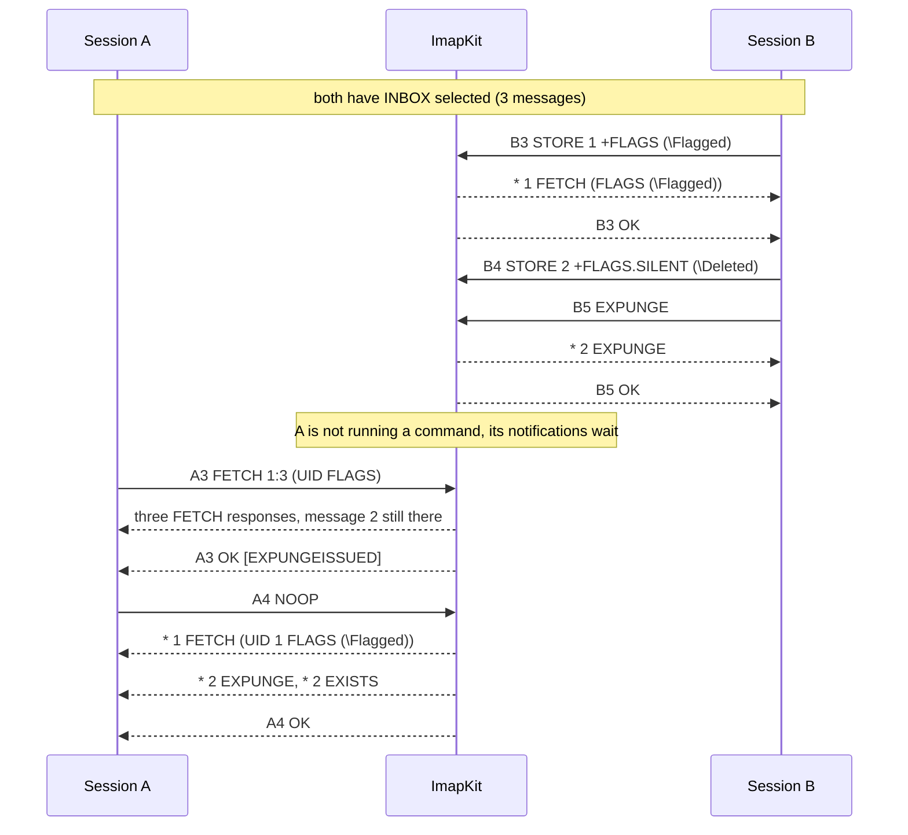

# Multiple sessions

Any number of clients can connect to one ImapKit server, and they all work on the same mailbox tree (see [Authentication](./authentication.md)). When one session changes a mailbox, the other sessions that have it selected learn about it through unsolicited responses: `EXISTS` for new messages, `EXPUNGE` for removed ones, and `FETCH` with the new flags.

Changes made with the [control API](../control-api/overview.md) reach the sessions the same way, as if another client had made them.

[RFC 2180](https://www.rfc-editor.org/rfc/rfc2180) lists several strategies a server may follow when a mailbox is used by more than one session at a time. ImapKit always follows the same ones, listed on this page, so a client can be tested against one consistent behavior.

## When notifications arrive

Notifications from other sessions are queued and sent before the tagged response of the next command the session runs. NOOP is the usual way for a client to collect them.



The rules:

- Nothing is sent while the session has no command in progress ([RFC 3501 section 5.3](https://www.rfc-editor.org/rfc/rfc3501#section-5.3)). The one exception is IDLE, see [IDLE](#idle).
- EXPUNGE responses are not sent during FETCH, STORE and SEARCH ([RFC 3501 section 7.4.1](https://www.rfc-editor.org/rfc/rfc3501#section-7.4.1)), nor during the commands that extensions add to that list, such as SORT and THREAD. The other notifications wait with them, so the session's message numbers stay the same until the command completes. When an EXPUNGE is pending, the tagged OK of such a command carries `[EXPUNGEISSUED]`, which tells the client to send NOOP soon ([RFC 5530 section 3](https://www.rfc-editor.org/rfc/rfc5530#section-3)).
- UID commands report the pending EXPUNGE responses before they run, since EXPUNGE is allowed during UID commands. UID SEARCH with message numbers in its criteria is the exception: it runs on the old numbers and the EXPUNGE waits.
- Unsolicited flag updates always include the UID: `* 1 FETCH (UID 2 FLAGS (\Seen))`. [RFC 9051 section 7.5.2](https://www.rfc-editor.org/rfc/rfc9051#section-7.5.2) requires it, and it is valid in IMAP4rev1 too. A message changed several times is reported once, with its current flags.
- The session that made a change gets the usual responses of its own command, never a notification of it.
- A session that has the mailbox selected gets an EXISTS with the new count after EXPUNGE responses caused by another session.

With QRESYNC enabled, EXPUNGE responses become `VANISHED`, and the NOTIFY plugin changes when and how events are sent, see [Synchronization](../extensions/synchronization.md).

## Expunged messages

A session that has not been told about the EXPUNGE of another session yet keeps its old message numbers. Until then, the expunged messages are "ghosts" in that session's view: they still have their numbers, but they are gone from the mailbox.

| Command         | What happens                                                                                                                                                                                                                 | RFC 2180                                                                         |
| --------------- | ---------------------------------------------------------------------------------------------------------------------------------------------------------------------------------------------------------------------------- | -------------------------------------------------------------------------------- |
| FETCH           | Still returns the expunged messages, ends with `OK [EXPUNGEISSUED]`                                                                                                                                                          | [Section 4.1.1](https://www.rfc-editor.org/rfc/rfc2180#section-4.1.1)            |
| SEARCH          | Still finds the expunged messages, ends with `OK [EXPUNGEISSUED]`                                                                                                                                                            | [Section 4.3](https://www.rfc-editor.org/rfc/rfc2180#section-4.3)                |
| STORE `.SILENT` | Stores the other messages, ends with `OK [EXPUNGEISSUED]`                                                                                                                                                                    | [Section 4.2.1](https://www.rfc-editor.org/rfc/rfc2180#section-4.2.1)            |
| STORE           | Stores the other messages with their FETCH responses, ends with `NO [EXPUNGEISSUED]` (with CONDSTORE, `NO [MODIFIED ...]` when that applies, [RFC 7162 section 3.1.3](https://www.rfc-editor.org/rfc/rfc7162#section-3.1.3)) | [Sections 4.2.2 and 4.2.3](https://www.rfc-editor.org/rfc/rfc2180#section-4.2.2) |
| COPY, MOVE      | Copy nothing, return the pending EXPUNGE responses and `NO [EXPUNGEISSUED]`                                                                                                                                                  | [Section 4.4.1](https://www.rfc-editor.org/rfc/rfc2180#section-4.4.1)            |
| UID commands    | Report the pending EXPUNGE responses first, then run. The UIDs of the expunged messages no longer exist and are ignored ([RFC 3501 section 6.4.8](https://www.rfc-editor.org/rfc/rfc3501#section-6.4.8))                     |                                                                                  |

The scenario of the diagram, as a real transcript. Lines start with the session (`A` or `B`), and some untagged SELECT responses are left out:

```text
A C: A2 SELECT INBOX
A S: * 3 EXISTS
A S: A2 OK [READ-WRITE] Completed
B C: B2 SELECT INBOX
B S: * 3 EXISTS
B S: B2 OK [READ-WRITE] Completed
B C: B3 STORE 1 +FLAGS (\Flagged)
B S: * 1 FETCH (FLAGS (\Flagged))
B S: B3 OK STORE completed
B C: B4 STORE 2 +FLAGS.SILENT (\Deleted)
B S: B4 OK STORE completed
B C: B5 EXPUNGE
B S: * 2 EXPUNGE
B S: B5 OK EXPUNGE Completed
A C: A3 FETCH 1:3 (UID FLAGS)
A S: * 1 FETCH (UID 1 FLAGS (\Flagged))
A S: * 2 FETCH (UID 2 FLAGS (\Deleted))
A S: * 3 FETCH (UID 3 FLAGS ())
A S: A3 OK [EXPUNGEISSUED] FETCH Completed
A C: A4 STORE 2 +FLAGS (\Seen)
A S: A4 NO [EXPUNGEISSUED] Some of the messages no longer exist
A C: A5 COPY 1:3 Archive
A S: * 1 FETCH (UID 1 FLAGS (\Flagged))
A S: * 2 EXPUNGE
A S: * 2 EXISTS
A S: A5 NO [EXPUNGEISSUED] Some of the requested messages no longer exist
A C: A6 NOOP
A S: A6 OK Completed
A C: A7 FETCH 1:* (UID FLAGS)
A S: * 1 FETCH (UID 1 FLAGS (\Flagged))
A S: * 2 FETCH (UID 3 FLAGS ())
A S: A7 OK FETCH Completed
```

FETCH `A3` still returns message 2 and shows the new flags of message 1, STORE `A4` touches only the expunged message and fails, and COPY `A5` is the first command that may report the EXPUNGE, so it does, copies nothing and fails. After that, message 2 is UID 3.

A UID command reports the EXPUNGE before it runs:

```text
B C: B3 STORE 1 +FLAGS.SILENT (\Deleted)
B S: B3 OK STORE completed
B C: B4 EXPUNGE
B S: * 1 EXPUNGE
B S: B4 OK EXPUNGE Completed
A C: A3 UID FETCH 1:* FLAGS
A S: * 1 EXPUNGE
A S: * 2 EXISTS
A S: * 1 FETCH (FLAGS () UID 2)
A S: * 2 FETCH (FLAGS () UID 3)
A S: A3 OK UID FETCH Completed
```

## IDLE

During IDLE ([RFC 2177](https://www.rfc-editor.org/rfc/rfc2177)) notifications are sent right away, without waiting for DONE. Continuing the session above, A starts IDLE while B appends a message, sets a flag and expunges another message:

```text
A C: A4 IDLE
A S: + idling
B C: B5 APPEND INBOX {18}
B S: + Go ahead
B C: Subject: new
B C:
B C: Hi
B S: * 3 EXISTS
B S: B5 OK APPEND Completed
B C: B6 STORE 1 +FLAGS (\Seen)
B S: * 1 FETCH (FLAGS (\Seen))
B S: B6 OK STORE completed
B C: B7 STORE 2 +FLAGS.SILENT (\Deleted)
B S: B7 OK STORE completed
B C: B8 EXPUNGE
B S: * 2 EXPUNGE
B S: B8 OK EXPUNGE Completed
A S: * 3 EXISTS
A S: * 1 FETCH (UID 2 FLAGS (\Seen))
A S: * 2 FETCH (UID 3 FLAGS (\Deleted))
A S: * 2 EXPUNGE
A S: * 2 EXISTS
A C: DONE
A S: A4 OK IDLE terminated
```

Only changes to the selected mailbox are reported. Anything other than `DONE` while idling is answered with BAD.

## `\Recent`

`\Recent` belongs to exactly one session ([RFC 3501 section 2.3.2](https://www.rfc-editor.org/rfc/rfc3501#section-2.3.2)):

- The first session that selects the mailbox read-write takes the `\Recent` flags. Later sessions see `0 RECENT`.
- EXAMINE shows the `\Recent` flags but does not take them ([RFC 3501 section 6.3.2](https://www.rfc-editor.org/rfc/rfc3501#section-6.3.2)).
- A new message is `\Recent` in one session that has the mailbox selected read-write, or, when there is none, for the next session that selects it.
- STATUS counts every message that is `\Recent` in any session, and does not take the flag.

Messages from the storage are `\Recent` only with `"recent": true`, see [Storage](./storage.md#recent). With one such message (some untagged responses left out):

```text
A C: A2 EXAMINE INBOX
A S: * 1 EXISTS
A S: * 1 RECENT
A S: A2 OK [READ-ONLY] Completed
B C: B2 SELECT INBOX
B S: * 1 EXISTS
B S: * 1 RECENT
B S: B2 OK [READ-WRITE] Completed
A C: A3 SELECT INBOX
A S: * 1 EXISTS
A S: * 0 RECENT
A S: A3 OK [READ-WRITE] Completed
```

After `ENABLE IMAP4rev2` a session gets no RECENT response and no `\Recent` flag, as RFC 9051 removed them.

## DELETE and RENAME

DELETE of a mailbox that other sessions have selected disconnects them with an untagged BYE ([RFC 2180 section 3.3](https://www.rfc-editor.org/rfc/rfc2180#section-3.3)), also when they are in IDLE:

```text
C C: C2 SELECT Work
C S: * 1 EXISTS
C S: C2 OK [READ-WRITE] Completed
B C: B9 DELETE Work
B S: B9 OK DELETE completed
C S: * BYE Selected mailbox was deleted
```

RENAME keeps the messages under the new name ([RFC 2180 section 3.4](https://www.rfc-editor.org/rfc/rfc2180#section-3.4)). Sessions that have the mailbox selected keep working on it and see new messages, but the old name no longer exists:

```text
A C: A2 SELECT Work
A S: * 1 EXISTS
A S: A2 OK [READ-WRITE] Completed
B C: B2 RENAME Work Projects
B S: B2 OK RENAME completed
B C: B3 APPEND Projects {18}
B S: + Go ahead
B C: Subject: new
B C:
B C: Hi
B S: B3 OK APPEND Completed
A C: A3 NOOP
A S: * 2 EXISTS
A S: A3 OK Completed
A C: A4 FETCH 1:* (UID)
A S: * 1 FETCH (UID 1)
A S: * 2 FETCH (UID 2)
A S: A4 OK FETCH Completed
A C: A5 STATUS Work (MESSAGES)
A S: A5 NO [NONEXISTENT] Mailbox does not exist
```

## Disconnects

A session that ends without LOGOUT or CLOSE does not expunge anything ([RFC 2683 section 3.1.2](https://www.rfc-editor.org/rfc/rfc2683#section-3.1.2)). CLOSE expunges the `\Deleted` messages without sending EXPUNGE responses to the closing session, the other sessions get them.

There is no inactivity timeout, a session stays open until the client or the test closes it. To test how a client handles a server that drops it, use [`server.control.disconnect()`](../control-api/users-and-sessions.md) or a [script rule](../faults/scripted-faults.md).

## Writing tests for this

The control API is the simplest way to be "the other session" in a client test: `server.control.addMessage()`, `setFlags()` and `expungeMessages()` change the mailbox while your client is connected, and the client gets the same unsolicited responses as above. See [Writing client tests](./writing-client-tests.md).
