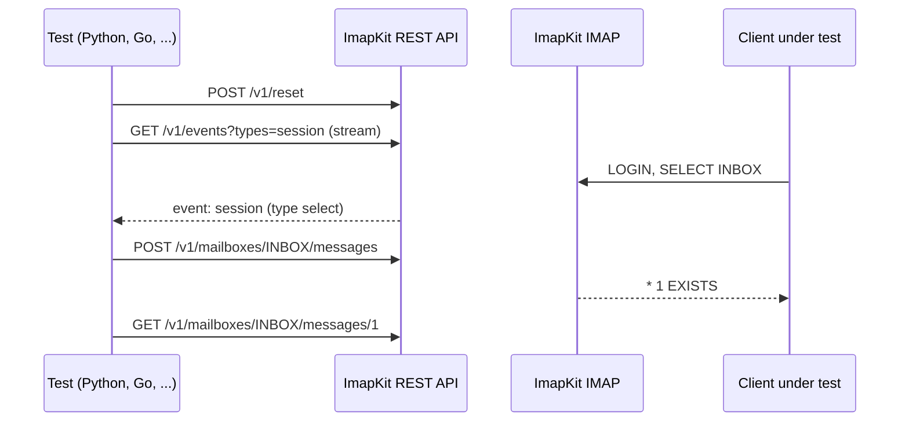

# Testing from Other Languages

ImapKit is written in TypeScript, but the client you test can be written in anything. Run ImapKit as a standalone process with `--rest-port`, and your test suite controls it over HTTP: the [REST API](../rest-api/overview.md) has every operation of the [control API](../control-api/overview.md), and [`GET /v1/events`](../rest-api/event-stream.md) streams the server events, so a test can wait for "the client selected INBOX" instead of sleeping.



## Start the server

Node.js 20 or newer has to be installed on the test machine. Then:

```bash
npm install -g imapkit
imapkit -p 1143 --plugin=IDLE,UIDPLUS,MOVE --rest-port=8143
```

```text
Starting ImapKit ...
ImapKit successfully listening on port 1143
REST API listening on 127.0.0.1:8143
```

The `REST API listening` line means both listeners are up, so a test harness can start the process and read its standard output until that line appears. All [command line options](../getting-started/command-line.md) work here: `--storage` for the starting mailboxes, `--config` for users and other server options, `--script` and `--quirk` for faults.

The REST API listens on `127.0.0.1` only. To reach it from another machine or container, set `--rest-host` and a `--rest-token`, and send `Authorization: Bearer <token>` with every request. It controls the whole server, so keep it inside the test environment.

## Reset between tests

Starting a process per test is slow in most languages, so start one server for the whole suite and reset it before every test:

```bash
curl -X POST http://127.0.0.1:8143/v1/reset -H 'Content-Type: application/json'
curl -X DELETE http://127.0.0.1:8143/v1/script/rules
```

`POST /v1/reset` restores the mailboxes and users of the server options (the `--storage` and `--config` files) and disconnects every session with `BYE`. Script rules survive a reset, so delete them too when tests add their own.

:::note
Every `POST` needs `Content-Type: application/json`, even without a body. Requests in any other form are refused with HTTP 415, which keeps web pages from calling the API.
:::

## The requests you need most

```bash
# deliver a message, like an incoming mail
curl -X POST http://127.0.0.1:8143/v1/mailboxes/INBOX/messages \
     -H 'Content-Type: application/json' \
     -d '{"raw": "Subject: hello\r\n\r\nHi!\r\n", "flags": ["\\Seen"]}'
# {"uid":1,"uidvalidity":1}

# change flags, mode is set, add or remove
curl -X POST http://127.0.0.1:8143/v1/mailboxes/INBOX/messages/flags \
     -H 'Content-Type: application/json' \
     -d '{"uids": [1], "flags": ["\\Flagged"], "mode": "add"}'
# [{"uid":1,"flags":["\\Seen","\\Flagged"]}]

# what the client stored, raw is the base64 source
curl http://127.0.0.1:8143/v1/mailboxes/INBOX/messages/1

# a mailbox name with a separator is URL encoded
curl -X POST http://127.0.0.1:8143/v1/mailboxes \
     -H 'Content-Type: application/json' -d '{"path": "Work/Projects"}'
curl http://127.0.0.1:8143/v1/mailboxes/Work%2FProjects

# connected sessions, and a fault for the next SELECT
curl http://127.0.0.1:8143/v1/sessions
curl -X POST http://127.0.0.1:8143/v1/script/rules \
     -H 'Content-Type: application/json' \
     -d '{"on": "command", "command": "SELECT", "times": 1, "send": "$TAG NO [UNAVAILABLE] Try again later\r\n"}'
```

Mailboxes are addressed by their storage name (modified UTF-7, the name a client sees in LIST) and messages by UID. Errors come back as `{ "error": { "code", "message" } }`, with HTTP 404 for `NONEXISTENT`, 409 for `ALREADYEXISTS` and failed mailbox operations, 400 for `INVALID` and 401 for a missing or wrong token. [Endpoints](../rest-api/endpoints.md) lists every route, and the running server describes itself at `GET /v1/openapi.json`.

## Wait for events

`GET /v1/events` is a [Server-Sent Events](https://html.spec.whatwg.org/multipage/server-sent-events.html) stream. `?types=` picks the event types: `session`, `command`, `mailbox`, `expunge`, `flags`, `acl`, `script` and `reset`.

```bash
curl -N 'http://127.0.0.1:8143/v1/events?types=session,command'
```

```text
: connected

event: session
data: {"type":"open","session":{"session":1,"user":null,"state":"Not Authenticated","mailbox":null,"readOnly":false,"enabled":[],"secure":false,"compressed":false,"remoteAddress":"::ffff:127.0.0.1"}}

event: command
data: {"session":1,"tag":"A1","command":"LOGIN","status":"OK","user":"testuser"}

event: session
data: {"type":"login","session":{"session":1,"user":"testuser","state":"Authenticated","mailbox":null,"readOnly":false,"enabled":[],"secure":false,"compressed":false,"remoteAddress":"::ffff:127.0.0.1"}}

event: session
data: {"type":"select","session":{"session":1,"user":"testuser","state":"Selected","mailbox":"INBOX","readOnly":false,"enabled":[],"secure":false,"compressed":false,"remoteAddress":"::ffff:127.0.0.1"}}
```

Every event is an `event:` line with the type and a `data:` line with JSON, followed by an empty line. Lines that start with `:` are comments (`: connected` when the stream opens, `: ping` every 15 seconds) and can be skipped. Open the stream before the action you wait for: the server only sends events that happen while the stream is open. See [Event stream](../rest-api/event-stream.md) for the data of every type.

The `session` event with `"type": "waiting"` and `"command": "IDLE"` tells you that a client has entered IDLE, the moment to deliver a message if you test push notifications.

## Python

This suite uses only the standard library: `unittest`, `urllib` for the REST API, a thread that reads the event stream, and `imaplib` as the IMAP client. In your project, the client under test takes the place of `imaplib`.

```python title="test_mail_client.py"
import imaplib
import json
import os
import queue
import shlex
import subprocess
import threading
import time
import unittest
import urllib.error
import urllib.parse
import urllib.request

IMAP_PORT = 1143
REST_PORT = 8143
REST = f"http://127.0.0.1:{REST_PORT}/v1"
# the command that runs ImapKit, e.g. "npx imapkit" in a project that has it as a dependency
IMAPKIT = shlex.split(os.environ.get("IMAPKIT", "imapkit"))


def call(method, path, body=None):
    """Calls the REST API, returns the decoded JSON answer"""
    data = json.dumps(body).encode() if body is not None else None
    request = urllib.request.Request(REST + path, data=data, method=method)
    if data is not None:
        request.add_header("Content-Type", "application/json")
    with urllib.request.urlopen(request) as response:
        return json.load(response)


class Events:
    """Reads GET /v1/events in a thread, wait() returns the first matching event"""

    def __init__(self, types):
        self.queue = queue.Queue()
        self.response = urllib.request.urlopen(f"{REST}/events?types={types}")
        threading.Thread(target=self._read, daemon=True).start()

    def _read(self):
        event = None
        try:
            for raw in self.response:
                line = raw.decode("utf-8").rstrip("\r\n")
                if line.startswith("event: "):
                    event = line[len("event: "):]
                elif line.startswith("data: "):
                    self.queue.put((event, json.loads(line[len("data: "):])))
        except Exception:
            pass  # the stream was closed

    def wait(self, event_type, match=lambda data: True, timeout=3):
        deadline = time.monotonic() + timeout
        while True:
            remaining = deadline - time.monotonic()
            if remaining <= 0:
                raise TimeoutError(f"no matching {event_type} event within {timeout}s")
            try:
                event, data = self.queue.get(timeout=remaining)
            except queue.Empty:
                continue
            if event == event_type and match(data):
                return data

    def close(self):
        self.response.close()


def setUpModule():
    global server
    server = subprocess.Popen(
        IMAPKIT + [f"--port={IMAP_PORT}", f"--rest-port={REST_PORT}", "--plugin=IDLE,UIDPLUS,MOVE"],
        stdout=subprocess.PIPE,
        text=True,
    )
    # the command prints this line once both listeners are up
    for line in server.stdout:
        if line.startswith("REST API listening"):
            break
    else:
        raise RuntimeError("imapkit did not start")


def tearDownModule():
    server.terminate()
    server.wait()
    server.stdout.close()


class MailClientTest(unittest.TestCase):
    def setUp(self):
        # every test starts from the initial mailboxes, without faults from an earlier test
        call("POST", "/reset", {})
        call("DELETE", "/script/rules")

    def connect(self):
        imap = imaplib.IMAP4("127.0.0.1", IMAP_PORT)
        imap.login("testuser", "testpass")
        self.addCleanup(imap.logout)
        return imap

    def test_delivery_reaches_a_polling_client(self):
        events = Events("session")
        self.addCleanup(events.close)
        subjects = []

        # stands in for the application under test: it selects INBOX and polls with NOOP
        def application():
            imap = imaplib.IMAP4("127.0.0.1", IMAP_PORT)
            imap.login("testuser", "testpass")
            imap.select("INBOX")
            for _ in range(50):
                imap.noop()
                status, data = imap.uid("SEARCH", "ALL")
                if data[0]:
                    status, fetched = imap.uid("FETCH", data[0].decode(), "(BODY.PEEK[HEADER.FIELDS (SUBJECT)])")
                    subjects.append(fetched[0][1].decode().strip())
                    break
                time.sleep(0.05)
            imap.logout()

        thread = threading.Thread(target=application)
        thread.start()

        # deliver only once the application has opened INBOX, no fixed sleep
        events.wait("session", lambda data: data["type"] == "select" and data["session"]["mailbox"] == "INBOX")
        added = call("POST", "/mailboxes/INBOX/messages", {"raw": "Subject: hello\r\n\r\nHi!\r\n"})
        self.assertEqual(added["uid"], 1)

        thread.join(timeout=5)
        self.assertEqual(subjects, ["Subject: hello"])

    def test_client_flags_are_stored(self):
        call("POST", "/mailboxes/INBOX/messages", {"raw": "Subject: one\r\n\r\n1\r\n"})
        imap = self.connect()
        imap.select("INBOX")
        imap.uid("STORE", "1", "+FLAGS", "(\\Flagged)")

        message = call("GET", "/mailboxes/INBOX/messages/1")
        self.assertIn("\\Flagged", message["flags"])

    def test_select_fails_once(self):
        rule = call("POST", "/script/rules", {"on": "command", "command": "SELECT", "times": 1, "send": "$TAG NO [UNAVAILABLE] Try again later\r\n"})
        imap = self.connect()
        self.assertEqual(imap.select("INBOX")[0], "NO")
        self.assertEqual(imap.select("INBOX")[0], "OK")

        rules = call("GET", "/script/rules")
        self.assertEqual([r["hits"] for r in rules if r["id"] == rule["id"]], [1])

    def test_errors_are_json(self):
        with self.assertRaises(urllib.error.HTTPError) as caught:
            call("GET", "/mailboxes/" + urllib.parse.quote("No such", safe=""))
        with caught.exception as error:
            self.assertEqual(error.code, 404)
            self.assertEqual(json.load(error)["error"]["code"], "NONEXISTENT")


if __name__ == "__main__":
    unittest.main()
```

```bash
python3 -m unittest -v test_mail_client.py
# or, without a global install: IMAPKIT="npx imapkit" python3 -m unittest -v test_mail_client.py
```

```text
test_client_flags_are_stored (test_mail_client.MailClientTest.test_client_flags_are_stored) ... ok
test_delivery_reaches_a_polling_client (test_mail_client.MailClientTest.test_delivery_reaches_a_polling_client) ... ok
test_errors_are_json (test_mail_client.MailClientTest.test_errors_are_json) ... ok
test_select_fails_once (test_mail_client.MailClientTest.test_select_fails_once) ... ok
```

A shorter script that walks through the same calls is in the repository as [examples/rest-api.py](https://github.com/postalsys/imapkit/blob/master/examples/rest-api.py).

## Go

The same pattern with the Go standard library: `TestMain` starts one server for the package, `call()` wraps the REST API, and `waitForSession()` reads the event stream in a goroutine. A raw IMAP connection plays the client under test.

```go title="imapkit_test.go"
package mailclient

import (
	"bufio"
	"bytes"
	"encoding/json"
	"fmt"
	"net"
	"net/http"
	"os"
	"os/exec"
	"strings"
	"testing"
	"time"
)

const (
	imapAddr = "127.0.0.1:1143"
	rest     = "http://127.0.0.1:8143/v1"
)

// TestMain runs one ImapKit server for the package, IMAPKIT overrides the command
func TestMain(m *testing.M) {
	command := strings.Fields(os.Getenv("IMAPKIT"))
	if len(command) == 0 {
		command = []string{"imapkit"}
	}
	server := exec.Command(command[0], append(command[1:], "--port=1143", "--rest-port=8143", "--plugin=IDLE,UIDPLUS")...)
	stdout, _ := server.StdoutPipe()
	if err := server.Start(); err != nil {
		panic(err)
	}
	lines := bufio.NewScanner(stdout)
	ready := false
	for !ready && lines.Scan() {
		ready = strings.HasPrefix(lines.Text(), "REST API listening")
	}
	if !ready {
		panic("imapkit did not start")
	}
	code := m.Run()
	server.Process.Kill()
	os.Exit(code)
}

// call sends a JSON request to the REST API and decodes the answer into out
func call(t *testing.T, method, path string, body, out any) {
	t.Helper()
	var payload bytes.Buffer
	if body != nil {
		json.NewEncoder(&payload).Encode(body)
	}
	req, _ := http.NewRequest(method, rest+path, &payload)
	if body != nil {
		req.Header.Set("Content-Type", "application/json")
	}
	res, err := http.DefaultClient.Do(req)
	if err != nil {
		t.Fatal(err)
	}
	defer res.Body.Close()
	if res.StatusCode >= 300 {
		t.Fatalf("%s %s: HTTP %d", method, path, res.StatusCode)
	}
	if out != nil {
		json.NewDecoder(res.Body).Decode(out)
	}
}

type sessionEvent struct {
	Type    string `json:"type"`
	Session struct {
		Session int    `json:"session"`
		Mailbox string `json:"mailbox"`
	} `json:"session"`
}

// waitForSession opens the event stream and returns a function that blocks until a matching session event
func waitForSession(t *testing.T, match func(sessionEvent) bool) func() sessionEvent {
	res, err := http.Get(rest + "/events?types=session")
	if err != nil {
		t.Fatal(err)
	}
	found := make(chan sessionEvent, 1)
	go func() {
		defer res.Body.Close()
		scanner := bufio.NewScanner(res.Body)
		for scanner.Scan() {
			data, ok := strings.CutPrefix(scanner.Text(), "data: ")
			var event sessionEvent
			if ok && json.Unmarshal([]byte(data), &event) == nil && match(event) {
				found <- event
				return
			}
		}
	}()
	return func() sessionEvent {
		select {
		case event := <-found:
			return event
		case <-time.After(3 * time.Second):
			t.Fatal("no matching session event")
			return sessionEvent{}
		}
	}
}

// command sends one IMAP command and returns every line up to its tagged response
func command(t *testing.T, conn net.Conn, reader *bufio.Reader, tag, line string) []string {
	fmt.Fprintf(conn, "%s %s\r\n", tag, line)
	var lines []string
	for {
		text, err := reader.ReadString('\n')
		if err != nil {
			t.Fatal(err)
		}
		lines = append(lines, strings.TrimRight(text, "\r\n"))
		if strings.HasPrefix(text, tag+" ") {
			return lines
		}
	}
}

func TestDeliveryReachesSelectedSession(t *testing.T) {
	call(t, "POST", "/reset", map[string]any{}, nil)
	selected := waitForSession(t, func(e sessionEvent) bool { return e.Type == "select" && e.Session.Mailbox == "INBOX" })

	conn, err := net.Dial("tcp", imapAddr)
	if err != nil {
		t.Fatal(err)
	}
	defer conn.Close()
	reader := bufio.NewReader(conn)
	reader.ReadString('\n') // greeting
	command(t, conn, reader, "A1", "LOGIN testuser testpass")
	command(t, conn, reader, "A2", "SELECT INBOX")
	selected()

	var added struct{ UID int }
	call(t, "POST", "/mailboxes/INBOX/messages", map[string]any{"raw": "Subject: hello\r\n\r\nHi!\r\n"}, &added)

	lines := command(t, conn, reader, "A3", "NOOP")
	if added.UID != 1 || lines[0] != "* 1 EXISTS" {
		t.Fatalf("uid %d, NOOP got %q", added.UID, lines)
	}
}
```

```bash
go test -v ./...
```

```text
=== RUN   TestDeliveryReachesSelectedSession
--- PASS: TestDeliveryReachesSelectedSession (0.01s)
PASS
```

## Other languages

Any language with an HTTP client works the same way. The pieces to build are always these:

1. **Start** `imapkit` once per suite with fixed ports, and read its output until `REST API listening`.
2. **Reset** before every test with `POST /v1/reset` and `DELETE /v1/script/rules`.
3. **Wait** on `GET /v1/events` with a timeout, opened before the action you wait for.
4. **Change** the server with the message, flag and mailbox endpoints while the client is connected.
5. **Assert** on `GET /v1/mailboxes/{path}/messages/{uid}`, `GET /v1/snapshot` or `GET /v1/sessions`.
6. **Stop** the process when the suite ends, or call `POST /v1/shutdown`.

Since one server is shared by the whole suite, run the tests that use it one at a time, or start one server per worker on its own ports.

## Read more

- [REST API overview](../rest-api/overview.md): security defaults, request and response formats.
- [Endpoints](../rest-api/endpoints.md): every route and its control API method.
- [Event stream](../rest-api/event-stream.md): the data of every event type.
- [Scripted faults](../faults/scripted-faults.md): the rules you can post to `/v1/script/rules`, in their JSON form.
