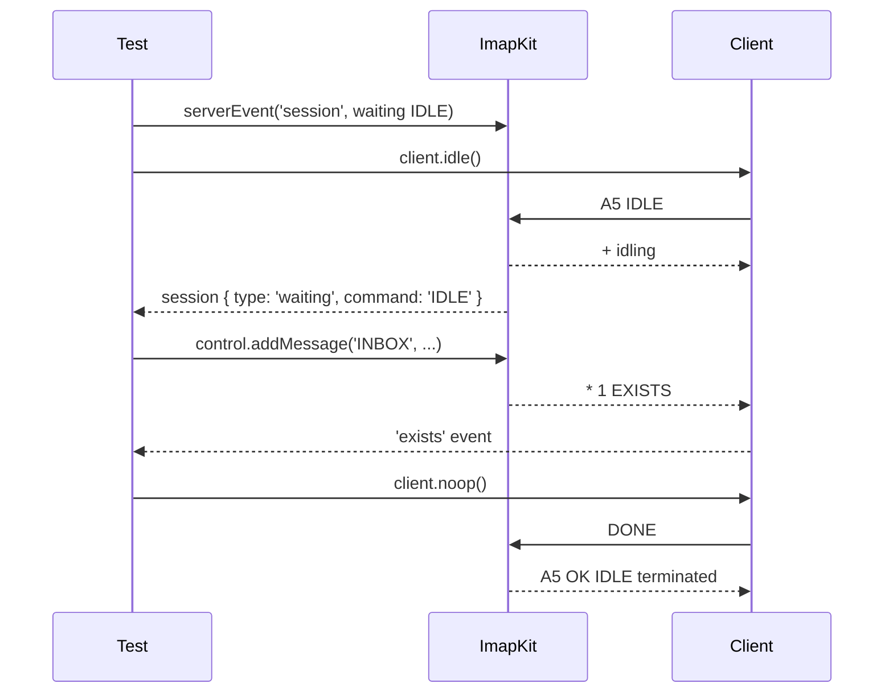

# Writing Client Tests

This guide collects the patterns that keep an IMAP client test suite fast, deterministic and free of sleeps. They come from real suites, most of all the ImapKit tests of [ImapFlow](https://github.com/postalsys/imapflow), which run every client feature against ImapKit with dozens of capability sets.

The examples use the [Node.js test runner](https://nodejs.org/api/test.html) and ImapFlow as the client under test. The ideas carry over to any test framework and any client.

## One server per test

ImapKit keeps one mailbox tree in memory, shared by every user and every session of that server. A test that changes it (appends, flags, deletes) would leak into the next one, so start a new server for every test. It takes a few milliseconds.

```javascript title="test/basic.test.mjs"
import { describe, it, beforeEach, afterEach } from 'node:test';
import assert from 'node:assert/strict';
import imapkit from 'imapkit';
import { ImapFlow } from 'imapflow';

describe('my client', () => {
    let server;
    let port;

    beforeEach(async () => {
        server = imapkit({ plugins: ['IDLE', 'UIDPLUS', 'MOVE'] });
        // a free port on the loopback address, so test files can run in parallel
        port = await server.start(0, '127.0.0.1');
    });

    // closes the server and every session that is still open
    afterEach(() => server.stop());

    it('creates a mailbox', async () => {
        const client = new ImapFlow({ host: '127.0.0.1', port, secure: false, auth: { user: 'testuser', pass: 'testpass' }, logger: false });
        await client.connect();
        await client.mailboxCreate('Projects');
        await client.logout();

        assert.equal(server.control.getMailbox('Projects').selectable, true);
    });
});
```

`server.start(port, host)` resolves with the port it listens on, a free one when `port` is `0` or missing. `server.stop()` closes the server and every session right away and resolves when it is closed.

## A test helper

A suite soon repeats the same setup: build a server, connect a client with the right options, clean up, collect what went over the wire. Put it in one helper that registers its own cleanup on the test context. This one is modeled on the `startImapKit()` fixture of ImapFlow:

```javascript title="test/helpers/imapkit.mjs"
import assert from 'node:assert/strict';
import imapkit from 'imapkit';
import { ImapFlow } from 'imapflow';

// A mailbox tree with the usual special-use folders
export const DEFAULT_STORAGE = {
    INBOX: {},
    '': {
        separator: '/',
        folders: {
            Archive: { 'special-use': '\\Archive' },
            Sent: { 'special-use': '\\Sent' },
            Trash: { 'special-use': '\\Trash' }
        }
    }
};

/**
 * Starts a fresh ImapKit server for one test and registers its cleanup on the test context.
 * Any BAD the server sends fails the test, unless `allowBad` is set.
 */
export async function startImapKit(t, serverOptions = {}, { allowBad = false } = {}) {
    const bad = [];
    const server = imapkit({
        plugins: ['IDLE', 'UIDPLUS', 'MOVE', 'SPECIAL-USE'],
        storage: DEFAULT_STORAGE,
        ...serverOptions,
        script: [
            // records every tagged BAD; `when` returns false, so the rule never acts
            {
                on: 'response',
                untagged: false,
                match: '^\\S+ BAD',
                when: context => {
                    bad.push(context.data.trim());
                    return false;
                },
                drop: true
            },
            ...[].concat(serverOptions.script || [])
        ]
    });
    const port = await server.start(0, '127.0.0.1');

    const clients = new Set();
    const wire = [];

    // a connected client under test, with options for this test on top of the defaults
    const connect = async (clientOptions = {}) => {
        const client = new ImapFlow({
            host: '127.0.0.1',
            port,
            secure: false,
            auth: { user: 'testuser', pass: 'testpass' },
            logger: false,
            emitLogs: true,
            disableAutoIdle: true,
            ...clientOptions
        });
        client.on('log', entry => {
            if (entry.src === 'c' || entry.src === 's') {
                wire.push(entry);
            }
        });
        // a session the server closes must not crash the test process
        client.on('error', () => {});
        clients.add(client);
        await client.connect();
        return client;
    };

    // resolves with the first server event that `match` accepts, rejects after `ms`
    const serverEvent = (event, match = () => true, ms = 3000) =>
        new Promise((resolve, reject) => {
            const timer = setTimeout(() => {
                server.off(event, listener);
                reject(new Error(`no matching ${event} event within ${ms}ms`));
            }, ms);
            const listener = data => {
                if (match(data)) {
                    clearTimeout(timer);
                    server.off(event, listener);
                    resolve(data);
                }
            };
            server.on(event, listener);
        });

    const matches = (msg, needle) => (typeof needle === 'string' ? msg.includes(needle) : needle.test(msg));

    t.after(async () => {
        for (const client of clients) {
            client.close();
        }
        await server.stop();
        if (!allowBad) {
            assert.deepEqual(bad, [], 'ImapKit answered client input with BAD');
        }
    });

    return {
        server,
        port,
        control: server.control,
        script: server.script,
        connect,
        serverEvent,
        // did the client send, or the server answer, a line that matches?
        sent: needle => wire.some(entry => entry.src === 'c' && matches(entry.msg, needle)),
        received: needle => wire.some(entry => entry.src === 's' && matches(entry.msg, needle))
    };
}
```

What each part buys you:

- **Defaults with overrides.** Every test gets a typical server and client, and passes only what it is about: `startImapKit(t, { plugins: ['IMAP4rev2'] })`, `kit.connect({ qresync: true })`.
- **Cleanup on the test context.** `t.after()` runs even when the test fails, so no server or socket outlives its test.
- **A BAD check for free.** ImapKit is [strict by design](strict-by-design.md): it answers client input that breaks the RFCs with `BAD`. The first script rule only looks at tagged responses and never acts, because `when` returns false. Any `BAD` the server sends fails the test, so every test is also a syntax check of what the client sent. Output that other script rules write (a canned `BAD` from a fault) does not go through this rule.
- **`serverEvent()`** waits for something to happen on the server, with a timeout instead of a hang.
- **`sent()` and `received()`** answer "did the client send `UID MOVE`?" from the client's own protocol log (ImapFlow emits it with `emitLogs: true`).

The rest of this guide uses this helper.

## Fixtures through the storage option

The `storage` option is the starting state of the server. Use it for everything that would take many IMAP commands to set up, or that a client can not set up at all: fixed UIDs with gaps, a UIDVALIDITY at the 32-bit limit, internal dates in the past, a mailbox that refuses new keywords, `\Noselect` levels, other namespaces and separators. See [Storage](storage.md) for every key.

```javascript title="test/storage.test.mjs"
import { test } from 'node:test';
import assert from 'node:assert/strict';
import { startImapKit } from './helpers/imapkit.mjs';

// a small RFC 5322 message builder keeps fixtures readable
const rfc822 = (subject, body = 'Hello world') =>
    `From: Sender <sender@example.com>\r\nTo: Receiver <receiver@example.com>\r\nSubject: ${subject}\r\nDate: Mon, 6 Oct 2025 10:00:00 +0000\r\n\r\n${body}\r\n`;

test('UID gaps and a UIDVALIDITY at the 32-bit limit', async t => {
    const kit = await startImapKit(t, {
        storage: {
            INBOX: {
                uidvalidity: 4294967295,
                uidnext: 5000,
                messages: [
                    { uid: 7, raw: rfc822('seven'), flags: ['\\Seen'], internaldate: '01-Jan-2020 10:00:00 +0000' },
                    { uid: 300, raw: rfc822('three hundred') }
                ]
            }
        }
    });
    const client = await kit.connect();
    const mailbox = await client.mailboxOpen('INBOX');
    assert.equal(mailbox.uidValidity, 4294967295n);
    assert.equal(mailbox.uidNext, 5000);
    const uids = (await client.fetchAll('1:*', { uid: true })).map(message => message.uid);
    assert.deepEqual(uids, [7, 300]);
    await client.logout();
});
```

Keep shared fixtures as constants or small builder functions in a helper module. The server copies the storage object, so one constant can serve every test.

:::tip
The storage is checked when the server is built. A typo like `message` instead of `messages` fails right away with the path of the problem, not with a confusing test failure later.
:::

## Wait for events, not for time

A test often has to wait until the client has done something before it changes the server: logged in, selected a mailbox, entered IDLE. A sleep makes the test slow and still flaky. ImapKit emits events at exactly these points:

| Event     | Payload                                                                                                                                                 |
| --------- | ------------------------------------------------------------------------------------------------------------------------------------------------------- |
| `session` | `{ type, session }`, `type` is `open`, `login`, `select`, `unselect`, `logout`, `waiting` (a command waits for client input, with `command`) or `close` |
| `command` | `{ session, tag, command, status, user }` when the tagged response of a command goes out                                                                |
| `mailbox` | `{ type, path, oldPath, mailbox, origin }` for CREATE, DELETE, RENAME, SUBSCRIBE and UNSUBSCRIBE                                                        |

[Events](../control-api/events.md) lists them all with their payloads. The most useful one is `waiting` with `command: 'IDLE'`: the server has sent the `+ idling` continuation and the client is now listening for changes.

```javascript title="test/idle.test.mjs"
import { test } from 'node:test';
import assert from 'node:assert/strict';
import { once } from 'node:events';
import { startImapKit } from './helpers/imapkit.mjs';

test('an idling client sees a delivered message', async t => {
    const kit = await startImapKit(t);
    const client = await kit.connect();
    await client.mailboxOpen('INBOX');

    // wait until the server has entered IDLE, not a fixed sleep
    const waiting = kit.serverEvent('session', event => event.type === 'waiting' && event.command === 'IDLE');
    const idling = client.idle();
    await waiting;

    const exists = once(client, 'exists', { signal: AbortSignal.timeout(3000) });
    kit.control.addMessage('INBOX', { raw: 'Subject: delivered\r\n\r\nHi!\r\n' });
    const [event] = await exists;
    assert.deepEqual(event, { path: 'INBOX', count: 1, prevCount: 0 });

    // any command ends IDLE
    await client.noop();
    await idling;
    assert.ok(kit.sent(/^DONE$/));
    await client.logout();
});
```

Two details make this reliable:

- **Subscribe before you trigger.** Create the `serverEvent()` promise before calling `client.idle()`, and the `once(client, 'exists')` promise before `addMessage()`. An event that fires before anyone listens is lost.
- **Always use a timeout.** `serverEvent()` rejects after 3 seconds, and `once()` gets an `AbortSignal.timeout()`, so a missing event fails the test with a clear message instead of hanging the run.



## Drive changes from the server side

The [control API](../control-api/overview.md) changes the server while clients are connected, and every change reaches the sessions the way a change by another client would: `EXISTS` for a new message, `EXPUNGE` (or `VANISHED` after `ENABLE QRESYNC`) for a removed one, an unsolicited `FETCH` for new flags, `BYE` when the mailbox is gone. Some situations can only be made this way, such as a new UIDVALIDITY for a mailbox the client already knows.

```javascript title="test/server-changes.test.mjs"
import { test } from 'node:test';
import assert from 'node:assert/strict';
import { once } from 'node:events';
import { startImapKit } from './helpers/imapkit.mjs';

test('a flag change on the server reaches the client', async t => {
    const kit = await startImapKit(t, {
        plugins: ['IDLE', 'ENABLE', 'CONDSTORE'],
        storage: { INBOX: { messages: [{ raw: 'Subject: one\r\n\r\n1\r\n' }] } }
    });
    const client = await kit.connect();
    await client.mailboxOpen('INBOX');

    const flags = once(client, 'flags', { signal: AbortSignal.timeout(3000) });
    kit.control.setFlags('INBOX', [1], ['\\Flagged'], 'add');
    await client.noop();
    const [event] = await flags;
    assert.equal(event.uid, 1);
    assert.ok(event.flags.has('\\Flagged'));
    await client.logout();
});

test('a new UIDVALIDITY ends the session that has the mailbox selected', async t => {
    const kit = await startImapKit(t, { storage: { INBOX: { messages: [{ raw: 'Subject: one\r\n\r\n1\r\n' }] } } });
    const client = await kit.connect();
    await client.mailboxOpen('INBOX');
    const closed = new Promise(resolve => client.once('close', resolve));
    const reset = kit.control.resetUidValidity('INBOX', { uids: 'shuffle', seed: 7 });
    await closed;
    assert.equal(client.usable, false);

    // a new session sees the new value
    const again = await kit.connect();
    const mailbox = await again.mailboxOpen('INBOX');
    assert.equal(mailbox.uidValidity, BigInt(reset.uidvalidity));
    await again.logout();
});

test('a server side disconnect reports the BYE text', async t => {
    const kit = await startImapKit(t);
    const client = await kit.connect();
    await client.mailboxOpen('INBOX');
    const closed = new Promise(resolve => client.once('close', resolve));
    assert.equal(kit.control.disconnect({ user: 'testuser' }, { text: 'Server maintenance' }), 1);
    await closed;
    assert.equal(client.byeReason, 'Server maintenance');
});

test('an ALERT between commands does not confuse the client', async t => {
    const kit = await startImapKit(t);
    const client = await kit.connect();
    await client.mailboxOpen('INBOX');

    const [{ session }] = kit.control.sessions();
    kit.control.inject(session, '* OK [ALERT] System shutdown in 10 minutes\r\n');

    await client.noop();
    assert.ok(kit.received('[ALERT] System shutdown in 10 minutes'));
    assert.equal(client.usable, true);
    await client.logout();
});
```

With `uids: 'shuffle'`, every old UID points to another message after the reset, so a client that ignores UIDVALIDITY shows the wrong mail. `seed` makes the shuffle the same in every run. See [UIDVALIDITY](../control-api/uidvalidity.md) for the other modes. `inject()` writes bytes to a session exactly as given, which is how a test sends untagged responses the server would not send on its own.

## Assert on the server state

A client can report success and still store the wrong thing. Read the result back from the server with the control API: the exact message bytes, the flags, the internal date, which mailboxes exist, which sessions are connected.

```javascript title="test/state.test.mjs"
import { test } from 'node:test';
import assert from 'node:assert/strict';
import { startImapKit } from './helpers/imapkit.mjs';

test('append stores the exact bytes, flags and date', async t => {
    const kit = await startImapKit(t);
    const client = await kit.connect();
    const source = 'From: a@example.com\r\nSubject: Tere\r\n\r\nÕun ja pirn\r\n';
    const appended = await client.append('INBOX', source, ['\\Seen', '$Label'], new Date('2026-05-01T10:20:30Z'));

    const stored = kit.control.getMessage('INBOX', appended.uid);
    assert.ok(stored.raw.equals(Buffer.from(source)));
    assert.deepEqual(stored.flags.sort(), ['$Label', '\\Seen']);
    assert.equal(stored.internaldate, ' 1-May-2026 10:20:30 +0000');
    await client.logout();
});

test('the client logs out instead of dropping the connection', async t => {
    const kit = await startImapKit(t);
    const commands = [];
    kit.server.on('command', event => commands.push(`${event.command} ${event.status}`));
    const client = await kit.connect();
    assert.equal(kit.control.sessions().length, 1);
    assert.equal(kit.control.sessions()[0].user, 'testuser');
    const closed = kit.serverEvent('session', event => event.type === 'close');
    await client.logout();
    await closed;
    assert.equal(commands.at(-1), 'LOGOUT OK');
});
```

`getMessage()` returns the source as a Buffer in `raw`, so the comparison is byte for byte, 8-bit content included. Internal dates come back in the IMAP `date-time` form (a day below 10 has a leading space). `server.control.snapshot()` returns the whole storage in the shape of the `storage` option, handy for a deep comparison or for starting another server from the same state.

## Check what the client sent

Three ways to look at the commands, from the most general to the most detailed:

- **The `command` event** gives the name and status of every command the server ran: `{ session, tag, command: 'UID MOVE', status: 'OK', user }`. It does not depend on the client, so it works for any client. A line that the server could not parse, or a command refused for ambiguous pipelining, gets its `BAD` without a `command` event (a command refused for its state or arguments still gets one, with `status: 'BAD'`).
- **The BAD check of the helper** catches every tagged `BAD`, those included.
- **The client's protocol log** has the full lines, for questions like "did it send `DONE`" or "did it use `COMPRESS DEFLATE`". The helper keeps ImapFlow's log for `sent()` and `received()`. For a client without a log, a script rule with a `when` function that records `context.data` and returns false sees every command line (`on: 'command'`) or every response (`on: 'response'`) without changing anything.

```javascript title="test/sent.test.mjs"
import { test } from 'node:test';
import assert from 'node:assert/strict';
import { startImapKit } from './helpers/imapkit.mjs';

test('the client used UID MOVE', async t => {
    const kit = await startImapKit(t, {
        storage: { INBOX: { messages: [{ raw: 'Subject: one\r\n\r\n1\r\n' }] }, '': { separator: '/', folders: { Archive: {} } } }
    });
    const commands = [];
    kit.server.on('command', event => commands.push(event.command));
    const client = await kit.connect();
    await client.mailboxOpen('INBOX');
    await client.messageMove('1:*', 'Archive', { uid: true });
    assert.ok(commands.includes('UID MOVE'), commands.join());
    await client.logout();
});
```

## Run one test against many capability sets

A client takes different code paths depending on what the server advertises: MOVE or COPY and EXPUNGE, UIDPLUS or not, LITERAL+ or synchronizing literals, IMAP4rev2 or IMAP4rev1, QRESYNC or plain flags. Plugins make each of these a one-line change, so run the same workflow against a matrix of profiles and assert that the end state is the same:

```javascript title="test/matrix.test.mjs"
import { describe, it } from 'node:test';
import assert from 'node:assert/strict';
import { startImapKit } from './helpers/imapkit.mjs';

const PROFILES = [
    { name: 'bare IMAP4rev1', plugins: [] },
    { name: 'UIDPLUS, no MOVE', plugins: ['UIDPLUS', 'SPECIAL-USE'] },
    { name: 'MOVE, no UIDPLUS', plugins: ['MOVE', 'SPECIAL-USE'] },
    { name: 'LITERAL+', plugins: ['LITERALPLUS', 'UIDPLUS'] },
    { name: 'IMAP4rev2', plugins: ['IMAP4rev2'] },
    { name: 'IMAP4rev2 with QRESYNC', plugins: ['IMAP4rev2', 'QRESYNC'], client: { qresync: true } }
];

describe('archive a message', () => {
    for (const profile of PROFILES) {
        it(profile.name, async t => {
            const kit = await startImapKit(t, {
                plugins: profile.plugins,
                storage: {
                    INBOX: { messages: [{ raw: 'Subject: one\r\n\r\n1\r\n' }, { raw: 'Subject: two\r\n\r\n2\r\n' }] },
                    '': { separator: '/', folders: { Archive: {} } }
                }
            });
            const client = await kit.connect(profile.client);
            await client.mailboxOpen('INBOX');
            await client.messageMove('1', 'Archive');

            // the same end state, whichever commands the client had to use
            assert.deepEqual(
                kit.control.listMessages('INBOX').map(message => message.uid),
                [2]
            );
            assert.equal(kit.control.getMailbox('Archive').messages, 1);
            // and the client used MOVE when the server offered it
            assert.equal(kit.sent(/ MOVE /), profile.plugins.includes('MOVE') || profile.plugins.includes('IMAP4rev2'));
            await client.logout();
        });
    }
});
```

Good profiles to include: a bare RFC 3501 server (`plugins: []`), a "typical" server (ID, IDLE, NAMESPACE, UNSELECT, UIDPLUS, MOVE, SPECIAL-USE, ENABLE, CONDSTORE, LITERALPLUS, ESEARCH), IMAP4rev2, and every plugin at once. Some plugins do not go into an "every plugin" list:

- LITERALMINUS and LITERALPLUS can not be loaded together, nor can MESSAGELIMIT and SAVELIMIT.
- ACL takes rights away from users other than the owner, LOGINDISABLED refuses LOGIN on plain connections, and UIDONLY refuses message sequence numbers after `ENABLE UIDONLY`. Test these on their own.
- METADATA-SERVER is a subset of METADATA.

See [Extensions](../extensions/overview.md) for the full list.

## Several sessions

Every `kit.connect()` opens another session on the same mailbox tree. ImapKit follows one consistent set of the RFC 2180 strategies, so cases that are timing dependent against a real server are deterministic here. See [Multiple sessions](multiple-sessions.md).

```javascript title="test/sessions.test.mjs"
import { test } from 'node:test';
import assert from 'node:assert/strict';
import { once } from 'node:events';
import { startImapKit } from './helpers/imapkit.mjs';

test('an expunge by another session', async t => {
    const kit = await startImapKit(t, {
        storage: { INBOX: { messages: [{ raw: 'Subject: doomed\r\n\r\n1\r\n' }, { raw: 'Subject: survivor\r\n\r\n2\r\n' }] } }
    });
    const client = await kit.connect();
    await client.mailboxOpen('INBOX');

    const other = await kit.connect();
    await other.mailboxOpen('INBOX');
    await other.messageDelete('1');
    await other.logout();

    const expunge = once(client, 'expunge', { signal: AbortSignal.timeout(3000) });
    await client.noop();
    assert.deepEqual((await expunge)[0], { path: 'INBOX', seq: 1, vanished: false });
    assert.equal(client.mailbox.exists, 1);
    await client.logout();
});
```

## Faults

ImapKit is correct by default. [Script rules](../faults/scripted-faults.md) make it fail at a chosen point, so the error handling of the client gets tested too. Add rules at runtime with `kit.script.add()`, which returns a handle with hit counts, or pass them in the `script` option:

```javascript title="test/faults.test.mjs"
import { test } from 'node:test';
import assert from 'node:assert/strict';
import { startImapKit } from './helpers/imapkit.mjs';

test('the client survives a SELECT that fails once', async t => {
    const kit = await startImapKit(t);
    const client = await kit.connect();
    const rule = kit.script.add({ on: 'command', command: 'SELECT', times: 1, send: '$TAG NO [UNAVAILABLE] Try again later\r\n' });

    await assert.rejects(client.mailboxOpen('INBOX'));
    const mailbox = await client.mailboxOpen('INBOX');
    assert.equal(mailbox.path, 'INBOX');
    assert.equal(rule.hits, 1);
    await client.logout();
});

test('a throttled STATUS returns false, the next one works', async t => {
    const kit = await startImapKit(t);
    const client = await kit.connect();
    kit.script.add({ on: 'command', command: 'STATUS', times: 1, send: '$TAG BAD Request is throttled\r\n' });

    assert.equal(await client.status('INBOX', { messages: true }), false);
    assert.equal((await client.status('INBOX', { messages: true })).messages, 0);
    await client.logout();
});

test('autologout during a long IDLE', async t => {
    const kit = await startImapKit(t, {
        script: { on: 'quiet', command: 'IDLE', quietFor: 50, send: '* BYE Autologout; idle for too long\r\n', close: true }
    });
    const client = await kit.connect();
    await client.mailboxOpen('INBOX');
    const closed = new Promise(resolve => client.once('close', resolve));
    await client.idle().catch(() => false);
    await closed;
    assert.equal(client.byeReason, 'Autologout; idle for too long');
});
```

The `BAD` in the second test comes from a script rule, not from the server's own checks, so the helper's BAD check does not count it. When a test makes the server itself answer with `BAD` on purpose, pass `{ allowBad: true }` as the third argument of `startImapKit()`.

[Quirk presets](../faults/quirk-presets.md) bundle rules that reproduce known server bugs (`quirks: ['m365-throttle']`), and `scriptSeed` makes random rules repeat exactly ([Repeatable tests](../faults/repeatable-tests.md)).

## Chaos: split output at random points

Real servers and networks deliver responses in arbitrary pieces: a CRLF split in two, a literal header in one packet and its data in the next. A client must reassemble lines and literals across any boundary. Rules with `chunk` write output in pieces, and `chunkDelay: 'tick'` sends each piece on its own event loop turn, so the pieces leave as separate TCP segments without slowing the test down.

Run the same workflow once over normal output and then over split output with several seeds, and compare:

```javascript title="test/chaos.test.mjs"
import { test } from 'node:test';
import assert from 'node:assert/strict';
import { startImapKit } from './helpers/imapkit.mjs';

const STORAGE = {
    INBOX: { messages: [{ raw: 'Subject: one\r\n\r\n' + 'x'.repeat(3000) + '\r\n' }, { raw: 'Subject: two\r\n\r\nshort\r\n', flags: ['\\Seen'] }] }
};

// a small seeded random number generator, so a failing run can be repeated
const random = seed => () => (seed = (seed * 1103515245 + 12345) % 2147483648) / 2147483648;

// rules that write a third of the output in pieces of 1 to 64 octets
const splitRules = seed => {
    const next = random(seed);
    return [1, 2, 3, 8, 64].flatMap(chunk =>
        ['greeting', 'continuation', 'response'].map(on => ({
            on,
            chunk,
            chunkDelay: 'tick',
            when: context => context.data.length > chunk && context.data.length <= chunk * 200 && next() < 1 / 3
        }))
    );
};

const workflow = async client => {
    const mailbox = await client.mailboxOpen('INBOX');
    const messages = await client.fetchAll('1:*', { uid: true, flags: true, envelope: true, source: true });
    return {
        exists: mailbox.exists,
        messages: messages.map(message => [message.uid, [...message.flags].sort(), message.envelope.subject, message.source.length])
    };
};

test('output split at random points gives the same results', async t => {
    const expected = await workflow(await (await startImapKit(t, { storage: STORAGE })).connect());
    for (let seed = 1; seed <= 5; seed++) {
        const kit = await startImapKit(t, { storage: STORAGE, script: splitRules(seed) });
        const client = await kit.connect();
        assert.deepEqual(await workflow(client), expected, `seed ${seed}`);
        await client.logout();
    }
});
```

Rules are checked in order and the first one that matches handles an output, so each rule takes a random share of what the earlier ones left. The `chunk * 200` limit keeps large responses away from the one-octet rule, which keeps the test fast. Put the seed in the assertion message, and a failure can be replayed with that seed alone. ImapFlow's suite runs this over plain, compressed (COMPRESS) and STARTTLS connections.

## Checklist

- Start a fresh server per test on port `0`, and stop it in `t.after()` or `afterEach()`.
- Put starting states in `storage`, not in setup commands.
- Wait on `session` and `command` events and on client events, always with a timeout. No sleeps.
- Make server-side changes with `server.control`, and read results back with it.
- Fail on any `BAD`, and allow it only in the tests that ask for one.
- Run the important workflows against several plugin sets.
- Add faults and split output once the happy paths pass.

For tests that are not written in JavaScript, the same patterns work over HTTP: see [Testing from other languages](testing-from-other-languages.md).
